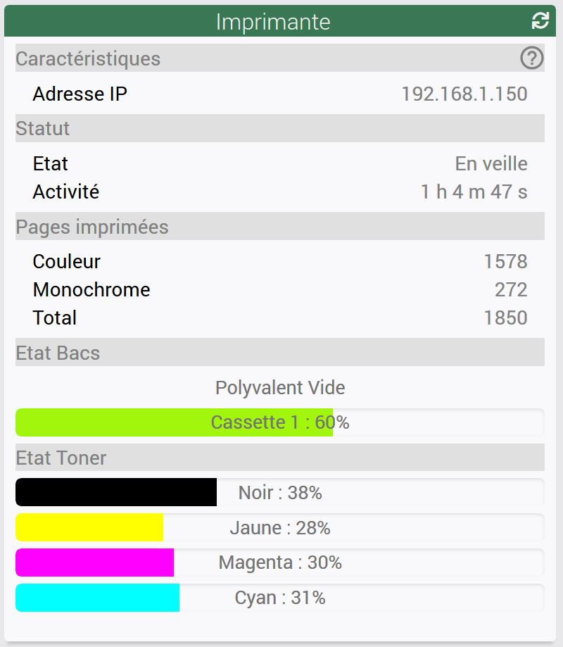
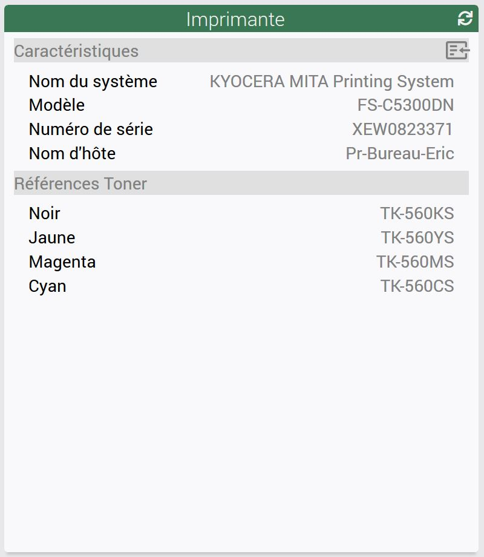

# Plugin printerStatus pour Jeedom

    Ce plugin permet de récupérer par snmp les informations de fonctionnement d'une imprimante IP.

## 1. Configuration du plugin

    Ce plugin a des dépendances qu'il faut installer si elles ne le sont pas déjà.

    Rien de particulier dans la configuration de ce plugin, vous pouvez choisir un des crons disponibles pour la
    réactualisation des informations.

## 2. Configuration de l'équipement

    La configuration est divisée en plusieurs onglets. L'onglet "Equipement" en plus des paramètres habituels permet 
    d'introduire l'adresse IP de l'imprimante.

    Les onglets "Oids..." permettent d'introduire les oids correspondant aux informations que l'on désire récupérer.

    L'onglet Widget permet de choisir l'utilisation du widget fourni avec le plugin ou le widget standard Jeedom

## 3. Le Widget 

    Le widget présente les informations de consommation de l'imprimante 

    L'icone en forme de point d'interrogation permet d'avoir accès à des informations additionnelles

## 4. Comment récupérer les OIDs

    Voici une documentation écrite par nerixs qui décrit les méthodes qu'il a utilisé pour récupérer les OIDs 
    de son imprimante.

    <a target="_blank" href="https://github.com/PhilippeJ-code/printerStatus/blob/master/docs/fr_FR/Imprimante réseau.pdf">Documentation Oids Imprimante</a>
    